# Introduction
## Objective
The objective of this project is to implement a data access and application layer for the additional features outlined in R7 and R8 of T3A2. Below is the proposed database schema to be implemented.

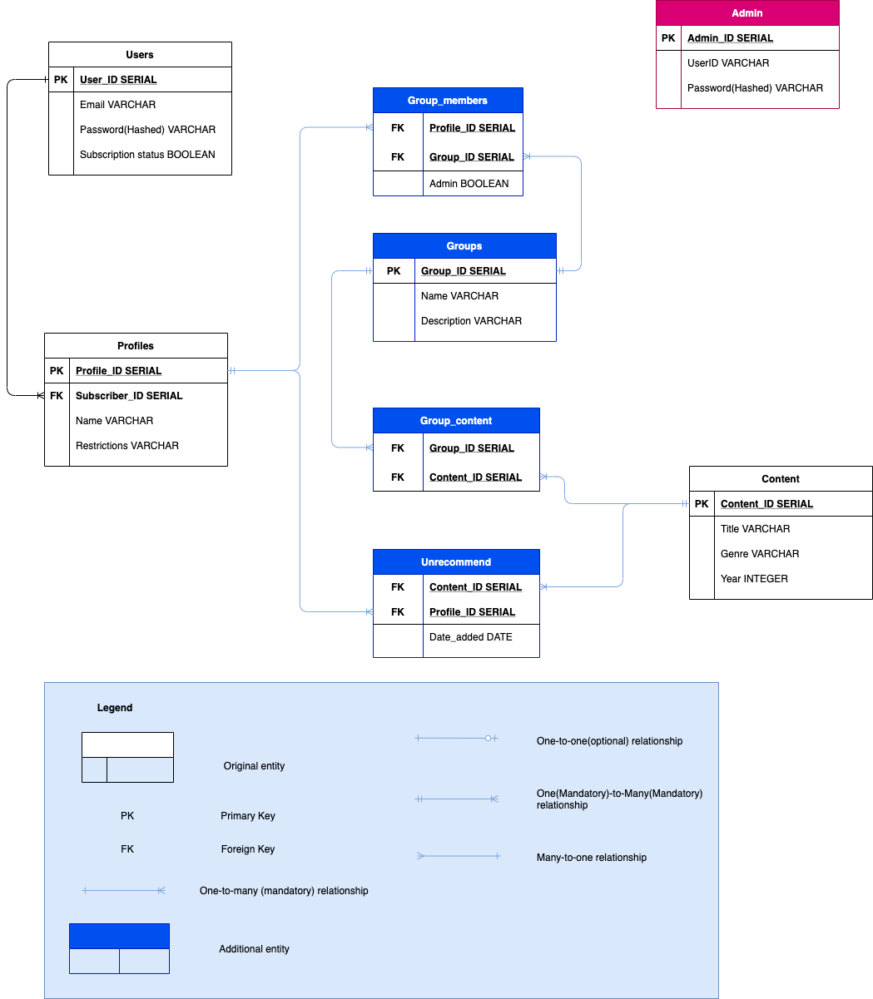

## User Interfaces
There are two user interfaces:-

### API
* Access: Using an API Client such as Insomnia

* Endpoints are constructed according to the RESTful convention. Here are the endpoint documentation for the API:
    * [Raw format](docs/api_endpoints.yaml)
    * [swagger viewer](https://petstore.swagger.io/?url=https://raw.githubusercontent.com/ashley190/T3A3/main/docs/api_endpoints.yaml)

* **Authentication and authorization**: API authentication uses JWT token and requires the token to be included in the header for endpoints that require authorization. 

    * Token is obtained through submitting the correct user/admin credentials to the login endpoints.
    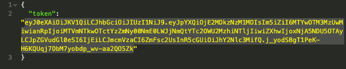 
    * Authorization headers are constructed and sent for endpoints that require authorization.
    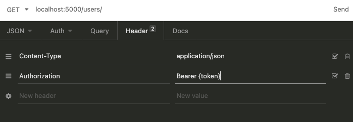

* **Body**: Endpoints that require a body to be sent will accept it in a JSON format.
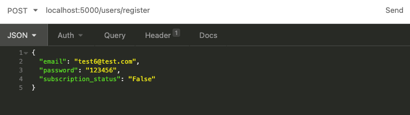

* **Responses**: Responses will also be received in a JSON format.
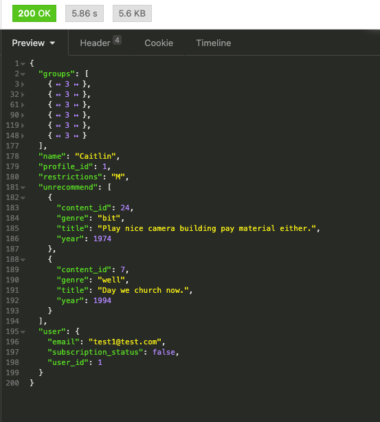

* Data validation and Error messages: Data is validated through the ORM and Marshmallow schemas and error messages are sent back to the user in the response data.
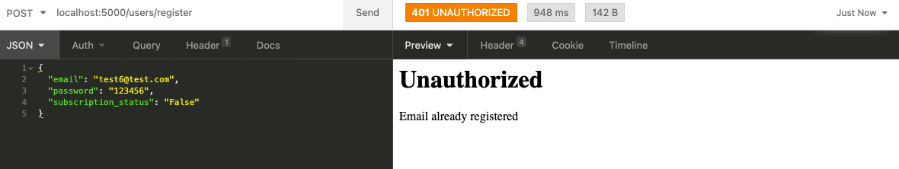

### Web application
* Access: Using a web browser

* Endpoints for the web interface does not subscribe to the RESTful convention due to the restrictions on methods such as PUT, PATCH and DELETE on web browsers. Here are the endpoint documentation:
    * [Raw format](docs/web_endpoints.yaml)
    * [Swagger viewer](https://petstore.swagger.io/?url=https://raw.githubusercontent.com/ashley190/T3A3/main/docs/web_endpoints.yaml)

* **Authentication and authorization**: Web authentication and authorisation is managed through the use of cookies through flask-login to maintain a Stateful session for a logged in user. Users/admin login through the login endpoint and if successful will gain access to user/admin functions.

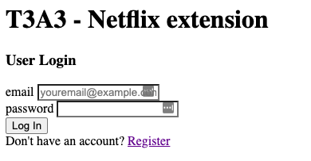

* **Data display**: Data on the web application is typically displayed in a tabular format with options displayed as tables/links. All links are functional.

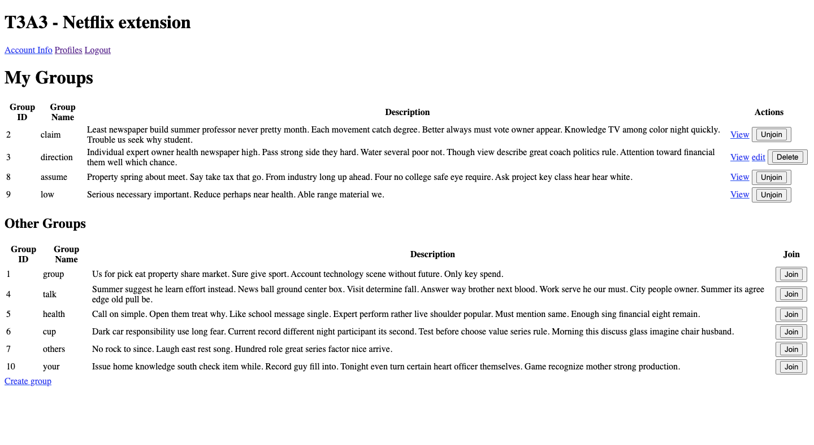

* **Create and Update functions**: Data is obtained for create and update functions through the use of forms.

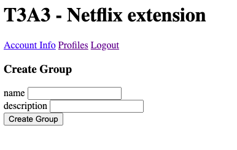

* **Alerts**: Alert messages are available to inform users of errors and actions performed.

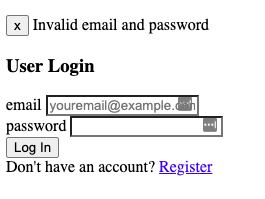

# Functionality

Unless otherwise specified, all listed functionalities are available on both the API and web application

## Users
* User registration
* User login
* User logout(web only)
* View user/account info
* Update user/account info
* Delete user account

## Profiles
* Show user profiles
* Show individual profiles by id
* Create new user profile
* Update user profile
* Delete user profile
* Show available content for each profile(web only)
* Show unrecommended content for each profile
* Unrecommend content
* Remove unrecommended content

## Groups
* View all groups for all profiles
* View group by id for group members and group admin
* Create group - users who create group automatically becomes group admin
* Update group for group admin only
* Delete group for group admin only
* Join group for all profiles
* Unjoin group for group members
* Remove member for group admin only
* Add group content for group members
* Remove group content for group members

## Content
* Show all available content(API only)

## Admin
Admin users are generated through the flask db-custom seed command and cannot be created any other way. Databases must be seeded for the admin function to be available.
* Admin login
* View user aggregate data
* View group aggregate data
* View content aggregate data - unrecommended and group content data
* Create content
* Delete content
* Backup database
* View available database backups
* Restore database from selected backup

# File structure
* [README.md](README.md) - This document
* [docs](docs) - contains all links and figures included in this README.
* [requirements.txt](requirements.txt) - application dependencies that needs to be installed for the application to be functional. See Installation section for details.
* [src](src) - source code for this application. Code is organised into several directories within src. This application is structured according to the MVC (Model-View-Controller) pattern.
    * [main.py](src/main.py) - main flask application. Registration and initiation of flask application.
    * [default_settings.py](src/default_settings.py) - Application configuration for different environments
    * [commands.py](src/commands.py) - custom commands that can be accessed on the command line interface. 
    * [.env.example](src/.env.example) - example .env file containing environment variables that need to be populated during the setup process 
    * [migrations](src/migrations) - database migration files to update database to the latest state as required by the application
    * [controllers](src/controllers) - route definition, request handling and application logic for API and web application endpoints. Web application controllers have the 'web_' prefix.
    * [models](src/models) - SQLAlchemy ORM models that interacts with the connected database.
    * [schemas](src/schemas) - SQLAlchemy Marshmallow schemas for serialisaton and deserialisation of database and python data
    * [templates](src/templates) - Jinja2 templates for rendering through the web application routes.
    * [forms.py](src/forms.py) - Forms constructed using wtforms for generating forms for the web interface, processed through web_controllers and rendered in the appropriate templates.
    * [tests](src/tests) - Integration tests for the API endpoints for use with Python's unittests
    * [backup](src/backup) - This does not come prepackaged in the application upon first clone but will be generated as the backup routes are used for backing up the database. Backups files are stored within timestamped folders and in separate files for separate database tables.

# Installation 
## Project folder and environment setup
The commands below assumes the use of bash script in a linux OS/mac OS. 
1. Install Python3.8, python3.8-venv and python3-pip installed on system

    `sudo apt-get install python3.8, python3.8-venv, python3-pip`

2. Obtain and navigate to project folder. This can be done through unzipping the project folder (as submitted) or cloning from github.

    `git clone https://github.com/ashley190/T3A3.git`

3. Create and activate virtual environment

    `python3.8 -m venv venv`
    `source venv/bin/activate`

4. Install requirements

    `pip install -r requirements.txt`

## Set up database

1. Install postgresql on your intended database host
2. Log into postgresql as postgres user
3. Set up 'netflix' database

    `CREATE DATABASE netflix;`

4. Create user 'flask'

    `CREATE ROLE flask;`

5. Grant all privileges on the 'netflix' database to 'flask'

    `GRANT ALL PRIVILEGES ON DATABASE netflix TO flask;`

6. Create password for the user 'flask'

    `ALTER USER flask WITH ENCRYPTED PASSWORD '<PASSWORD>'`

7. Create the .env file using the .env.example template and fill in the missing fields in the .env file:- If you've followed steps 3 - 6, the following fields should be:-

    * `<user>` = flask
    * `<password>` = password that was set for user flask
    * `<host>` = localhost or the public ip address where the postgres database is hosted
    * `<port>` = default port for postgresql is 5432
    * `<dbname>` = netflix

8. Set up other variables within the .env folder. These secret keys can be anything you specify but cannot be left blank.

9. Navigate to the src folder in the project and export the required flask environment variables. For example to load flask in the development environment, you can run the following commands in bash to export the required environment variables. The 'development' environment can be used to access both applications.

    `export FLASK_APP=main.py:create_app()`
    `export FLASK_ENV=development`

## Run Migrations
1. Initialise the use of migrations

    `flask db init`

2. Run all saved migrations

    `flask db upgrade`

3. Database tables can be seeded using the following command to populate with dummy data. Database tables MUST be seeded in order for admin functionality to be accessed:

    `flask db-custom seed`

## Backup and Restore data through the command line
1. (Optional) If there are any saved postgresql pg_dump files, they can be restored using the following command.

    `pg_restore -h <host> -p <port> -d netflix -U flask -a <relative_file_path>`

2. In order to create a data dump on your current database, the following command can be used:

    `pg_dump -Fc -h <host> -U flask netflix -a > <relative_file_path/file_name>`

# Troubleshooting

* Cannot connect to database remotely(assuming a postgresql database is used)

    * Try running the following command:

    `psql --host=[Endpoint] --port=5432 --username=[username] --password --dbname=[database name]`

    * Try configuring the database config file:

        1. (in psql on the computer where your database resides) Run `show config_file` and `show hba_file` and note down both paths
        2. Exit psql and access config file through the path shown through `show config_file` in step 1.
        3. Under 'Connections and Authentication", unhash listen_addresses and change listen addresses='*'.
        4. Access the hba file through the path hown through `show hba_file` in step 1.
        5. Configure your hba_file settings to the following:-
        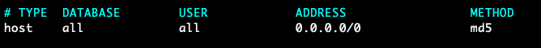

* Web pages not loading correctly - try clearing the cache on your browser

* Can't login to admin interface - Run `flask db-custom seed` to ensure admin tables are seeded. Two admin users are created with the usernames 'Admin1' and 'Admin2' with password '654321'.

# Continuous integration

The steps involved in the Continuous Integration(CI) workflow upon pushing onto GibHub:-
1. Checks out project from github into a virtual machine(VM) running on ubuntu-latest.
2. Installs Python3.8 on the VM
3. Installs dependencies as specified on requirements.txt
4. Run Automated tests
5. Checks code according to PEP8 style guide using flake8

## Reports
[Report 1: Privacy and Security Analysis](docs/report-privacy_security.md)

[Report 2: Professional, Ethical and Legal Obligations](docs/report-prof_ethical_legal)
