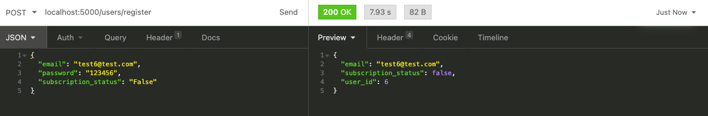

# Privacy and Security Report

## Objective
This report aims to provide an overview of the data being stored and methods used to safeguard user data in this application.

## Data stored
Data that is held on the database include user data such as email provided by the user as well as data collected from user behaviour such as group and content preferences from different profiles that can have commercial interests to Netflix. Although not collected through this application, Netflix also collects and store highly sensitive data such as credit card details for the upkeeping of user subscriptions. It is therefore important that data on this application is safeguarded. 

## User interfaces
There are two user interfaces included with this application which has slightly different requirements for user experience. The API interface is a stateless application whereby the server does not store or persist session information while the web application accessed through web browsers require a stateful approach whereby session information is stored through the use of cookies. 

A potential threat in this setup in having two separate interfaces is that it exposes the application for attack by providing potential attackers more options for attack. 

## Safeguarding data
Several methods are used to safeguard data on this application. This include the following:-
1. Authorisation and Authentication

    User and admin authentication is implemented through the use of basic email/username and password authentication of registered users. Upon authentication, APi users are provided with a JWT token that needs to be included in the authorisation header to access API functionality. Meanwhile the login process for users of the web application users are managed using cookies to maintain each session.
    
    The generation of JWT tokens and login cookies for the web application makes use of secret keys set and stored and as local environment variables during production limiting any access to them even when the code is shared in public such as GitHub.
    
    Additionally, JWT tokens are set to have an expiry limit of 1 day before needing to be renewed. 

    New users have the option to register for a user account to access user functionalities. However there isn't an interface for admin users to register for an email. 

2. Password handling

As passwords are used predominantly for authentication, it is important that they are not easily retrieved and deciphered. Several steps are taken to ensure that passwords on this application are secured.

* Hashing - All passwords are hashed using the bcrypt function that makes it more resistant to brute force attacks due to the increased computational resources required to decrypt a bcrypt hash.

* Password verification - Passwords are hashed during the user creation process before being stored on the database. During the login process, passwords are hashed and compared with the hashed passwords in the database to confirm a match/mismatch.

* Password length - All passwords are required to have a minimum of 6 characters to increase their complexity and reduce likelihood of them being cracked through brute-force attempts. 

* Transmission - Apart from passwords being sent from the client to the server for login/registration process, passwords(in hash/plain text) are obscured from users and are not present in any response data back to the client. In a live example below, while the password is being sent in the request body (on the left), the response data (on the right) does not reflect any password information/hashes.

3. Object Relational Mapping and Schema Validation
Object Relational Mapping between the flask application (written in Python) and the database (written in PostgreSQL) is implemented through the use of Flask-SQLAlchemy. This enables the abstraction of the database connection into Models as per the MVC pattern so that there is no direct connection and interaction between the application and the database. This reduces the risk of SQL injections as the controllers can sanitise and process user input and generates queries through ORM to the database. Additional data validation is conducted though the database schemas such as validating for data types, empty values and other requirements such as length of strings. 

## Additional Security measures
Several other measures that have not been implemented that can enhance security include:-

1. Ideally, admin users must be created through a logged in admin account (has not been implemented) after a potential admin user has been vetted through business rules due to the fact that admin users have access to overall user data. 

2. User and administrator functionalities must be separated through different routes with user verification whereby users and administrators are not able to access functionality that they are not authorised to access. As users and admin are kept in separate databases with a similar sequence for primary keys, authorization is failing to differentiate users and admin that share the same primary keys in their respective tables. 
    
    * A possible fix is to alter the primary key sequences to the users and admin tables respectively so they do not overlap. 
        
    * Another possible solution is to  integrate both users and admin into a single table with an additional column with boolean values to mark admin users against normal users. Verification of admin users on all admin endpoints will need to be updated to check for admin users. User registration can be set to only register users whereas another endpoint can be added as an additional admin endpoint for the creation of admin users by other verified admin users. It will be more secure for admin and users to be kept on separate tables with no overlap from a security perspective.

3. Architectural implementation - This application can be deployed with security being one of the main consideration in its deployment architecture. Deploying the application into a secure cloud environment such as AWS will offer the following security features:-

    * Data protection through encryption and key management
    * Threat detection and continuous monitoring by AWs
    * Identity and access management through Amazon's identity services
    * Compliance and data privacy with compliance monitoring and reporting
    * Infrastructure protection through rules based traffic filtering

    One of the suggested deployment is for the application within a virtual private cloud(VPC) with the application deployed in a public subnet and the database deployed in a private subnet. 
    
    As it is the function of the application to receive and respond to requests, it is deployed in a public subnet that receives inbound and outbound communications.

    It is important for the database to be placed in a private subnet and configured to only accept incoming connections and requests from the application in the public subnet. As the application and database both sit in the same Virtual Private Cloud they can communicate as if they are in a virtual LAN and does not need a connection through the public internet.

    The database is allowed to make outbound connections through a NAT gateway for administrative purposes like updates but does not accept any incoming connection from the public internet. 

    Security rules and network filtering for the application in the public subnet can be configured on several layers namely the EC2 instance itself, the public subnet and the the internet gateway. 

## Conclusion
In conclusion, data that is stored in this application must be secured due to it storing user and business sensitive data. 

Security measures put in place for data security and privacy include the use of authentication and authorisation of users and admin users, password hashing, and the use of object relational mapping however additional security measures can be implemented in future iterations and at the deployment stage to ensure the application and its data is robust from a security perspective.

## References

1. Difference between stateless and stateful protocols. Tutorialspoint.com. Published 2019. Accessed December 31, 2020. https://www.tutorialspoint.com/difference-between-stateless-and-stateful-protocols
2. Wikipedia Contributors. bcrypt. Wikipedia. Published December 23, 2020. Accessed January 1, 2021. https://en.wikipedia.org/wiki/Bcrypt
3. Cloud Security, Identity, and Compliance Products – Amazon Web Services (AWS). Amazon Web Services, Inc. Published 2021. Accessed January 1, 2021. https://aws.amazon.com/products/security/
