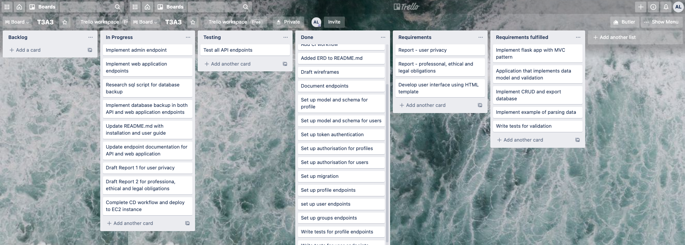

# Professional, Ethical and Legal Obligations

## Professional Obligations
### Project Delivery
A project plan was put in place to ensure completion of this project on time and within the required scope. This project plan was then managed through the use of a Trello board. The image below is a screen capture during the completion of the API endpoints and prior to the beginning of the development of the web application with objectives laid out in a separate column on the right section to keep track of project objectives.

### Project Maintenance
The completed project will continue to be maintained through the use of a CI/CD pipeline whereby code will be pushed up to GitHub and deployed on an EC2 instance. 

# Ethical Obligations
The implementation and documentation of this application fulfillse several ethical obligations in the IT profession, namely the following:-
1. Honesty: An analysis of security vulnerabilities has been laid out in [Report 1](report-privacy_security.md) with complete honesty on where vulnerabilities may lie in the completed application to the best of the developer's knowledge and steps taken to mitigate it. Where it is not possible within the implementation of this project, suggestions are provided to manage security risks for the application.
2. Priorities: Priorities are placed on preserving the integrity, security and confidentiality of user and proprietary data as laid out in [Report 1](report-privacy_security.md). 
3. Competence: The project objectives were fulfilled to the best of the developer's abilities and knowledge with a thorough project management plan in place to deliver on project objectives on time and within scope. Testing of the application has been performed through both automated testing and manual testing and bugs are recorded and fixed where possible. The bugs that were not found but were not able to be fixed will be outlined in the troubleshooting/bugs section in the main [README.md](../README.md).

# Legal Obligations

The main considerations around legal obligations revolve around data privacy and protection as the application mainly holds user and proprietary data that is of business interests. The data contained in this application can also be used on an analysis of user behaviour on Netflix that has commercial value to third parties.

It is therefore important for data security to be safeguarded using the measures and potential measures outlined in [Report 1](report-privacy_security.md). 

Another potential legal obligation is ensuring that the application does not become a platform for unwanted content. Since only admin users can manage the content on the application, it is crucial that they are vetted and trained to be compliant with regulations and guidelines in posting content on the platform. If the application is susceptible to users posting unacceptable content, having in place user's term's and conditions outlining the conditions of use and actively policing usage of the application will be required. 

There are also additional regulatory requirements if the application collects and stores sensitive information such as users credit card information for the maintenance of a subscription. The additional functionality of developing payment appilcations in software requires the compliance to PCI Data Security Standards (PCI-DSS) for the protection of credit card data. In order to comply with the PCI-DSS, the application must aim to fulfill the following compliance goals:-
1.  Building and maintaing a secure network for protection of cardhoder data
2. Implement encryption when transmitting cardholder data across open, public networks
3. Build and maintain secure systems and networks
4. Implement strong access control measures on a business need-to-know basis
5. Regularly monitor and test networks for vulnerabilities
6. Develop and maintain an Information security policy.

In a real-world scenario where this application is built in accordance to a Service Level Agreement or a contract with a client, contractual obligations must also be met. 

# Conclusion
There are various professional, ethical and legal obligations that one must be fulfilled in the course of developing any software application and therefore it is important that a developer is familiar with these requirements and complies with them through the course of the development of the application from the planning phase all through to deployment. Future obligations must also be taken into consideration when implementing a software development plan in order to guide the development of a compliant software from all perspective.

# References
1. ACS Code of Ethics. Uwa.edu.au. Published 2021. Accessed January 1, 2021. https://teaching.csse.uwa.edu.au/units/CITS3200/ethics/acs-ethics.htm
2. Official PCI Security Standards Council Site - Verify PCI Compliance, Download Data Security and Credit Card Security Standards. Pcisecuritystandards.org. Published 2021. Accessed January 1, 2021. https://www.pcisecuritystandards.org/pci_security/maintaining_payment_security
3. James J. Legal liabilities that programmers need to consider. TechRepublic. Published August 19, 2011. Accessed January 1, 2021. https://www.techrepublic.com/blog/software-engineer/legal-liabilities-that-programmers-need-to-consider/